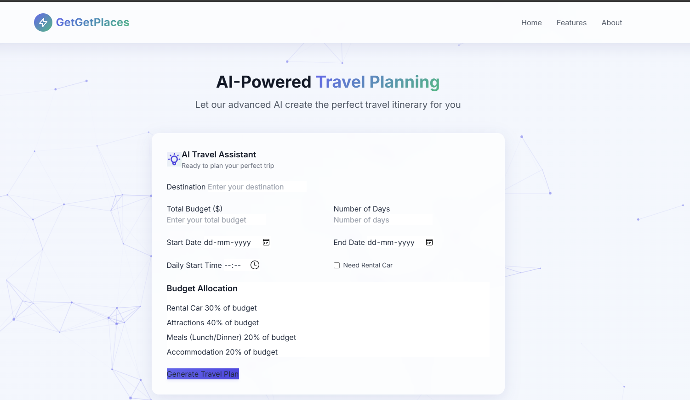
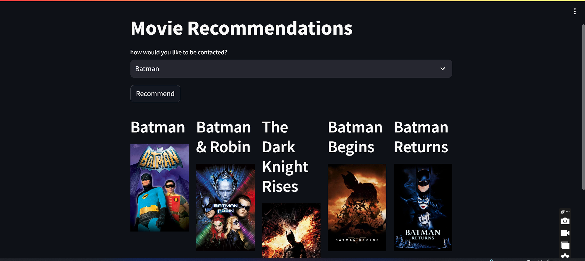
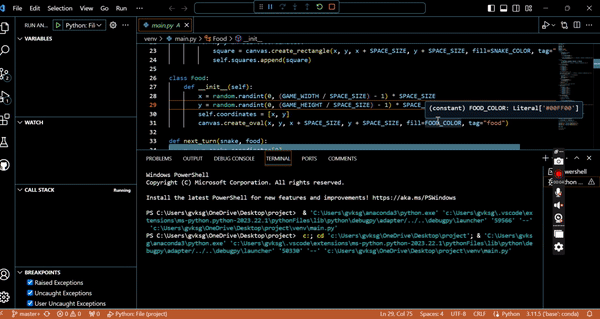
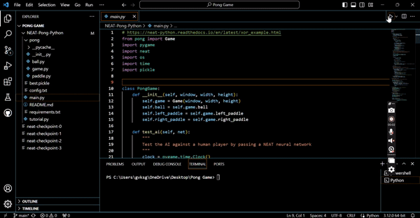

<h1 align="center">🚀 Santhosh Guntupalli</h1>
<h3 align="center">Elite Data Engineer | ML & AI Strategist | Cloud-Native Architect</h3>

  

---

## 🔍 About Me

 I’m a **versatile data and AI engineer** with a strong foundation in Business Intelligence, Data Analysis, and Cloud Infrastructure — and deep expertise in scalable pipelines, advanced ML models, and production-ready LLM workflows. I specialize in delivering end-to-end solutions that power real-time analytics, optimize performance, and enable intelligent automation.

I thrive at the **intersection of engineering, intelligence, and product strategy**, delivering insights that move metrics and models that scale.

---

## 🧠 Technical Proficiency

<strong>👷‍♂️ Data Engineering & Cloud</strong>

- **Languages:** Python, Scala, SQL, Shell  
- **Data Platforms:** Spark, Kafka, Flink, Hadoop  
- **Pipelines:** Databricks, Airflow, ADF, AWS Glue  
- **Cloud:** AWS, GCP, Azure | Data Lakes, Snowflake, Redshift, Synapse, BigQuery  
- **Infra & CI/CD:** Docker, Kubernetes, Terraform, GitHub Actions  

<strong>🧠 AI / Machine Learning</strong>

- **Frameworks:** PyTorch, TensorFlow, scikit-learn, PySpark  
- **LLMs & NLP:** HuggingFace, LangChain, spaCy, NLTK  
- **Model Deployment:** FastAPI, Streamlit, BentoML, MLflow  
- **Specialties:** AutoML, Recommender Systems, Time Series (ARIMA, LSTM), RAG pipelines  

<strong>📊 Business Intelligence & Visualization</strong>

- **Tools:** Tableau, Power BI, Superset, Jupyter  
- **Focus:** Executive dashboards, KPI storytelling, real-time insights  

<strong>🗃️ Databases, APIs & File Formats</strong>

- **Databases:** PostgreSQL, MongoDB, MySQL, Oracle, DynamoDB  
- **APIs:** REST, GraphQL, gRPC | JSON, Parquet, Avro, Protobuf  

<strong>🧩 Other Strengths</strong>

- Data Governance, Unity Catalog, Lineage Tracking  
- Scalable System Design, Agile/Scrum, Cross-functional collaboration  
- Performance Optimization, Cost Efficiency in Cloud Ops  

---

## 🌐 Portfolio & Visualizations

- 🔗 [**Portfolio Website**](https://guntupalli09.github.io/Santhosh_Guntupalli.github.io/)  
- 📈 [**Tableau Dashboards**](https://public.tableau.com/app/profile/santhosh.guntupalli/vizzes)  
- 📫 [**Email Me**](mailto:santhosh.guntupalli09@gmail.com)

---

## 🤝 Connect With Me

---

## 🚀 Featured Projects

### 1. ⚡ GetGetLeads – AI Lead-to-booking & Digital Marketing Agent

<table>
<tr>
<td width="60%">
GetGetLeads is a comprehensive, all-in-one platform designed specifically for small businesses in the salon, med spa, and real estate industries. It combines lead generation, CRM, email automation, social media automation, calendar management, and AI-powered content generation to help small businesses scale efficiently.

**Features:**
- Smart Lead Management**
- AI-Powered Email Automation
- Calendar Integration
- Google Calendar two-way sync
- AI Content Generation
- Reviews & Referrals Automation
- Analytics Dashboard
- Niche-Specific Support
- Multi-platform posting and social automation
</td>
<td>

</td>
</tr>
</table>

---
### 2. 👥 GhostWriter Teams

<table>
<tr>
<td width="60%">
An AI-first marketing platform simulating a creative team using LangChain & local LLMs. Five role-based agents collaborate in real-time to generate calendars, critiques, and campaigns.

**Agents:** Zara (Creative), Max (Writer), Mira (Research), Eva (Critique), Leo (Brand Guardian)
</td>
<td>

</td>
</tr>
</table>

---

### 3. ✈️ GetGetPlaces – AI Travel Planner

<table>
<tr>
<td width="60%">
A conversational travel agent powered by weather APIs, budget intelligence, and ML routing.

**Core Functions:**
- Natural language trip planning  
- Weather-aware scheduling  
- ARIMA price forecasting  
- Personalized itineraries & smart routing  
- DB-ready architecture with PostgreSQL backend  
</td>
<td>

</td>
</tr>
</table>

---

### 4. 🎬 [Movie Recommendation Engine](https://mrs-sg-bfc2e6fa78db.herokuapp.com/)

<table>
<tr>
<td width="60%">
A content-based recommendation system using NLP similarity scoring with TF-IDF and cosine distance.

**Stack:** Flask, scikit-learn, NLTK, Pandas, Jupyter  
</td>
<td>

</td>
</tr>
</table>

---

### 5. 📊 [Tableau Dashboards](https://public.tableau.com/app/profile/santhosh.guntupalli/vizzes)

Advanced business visualizations for real-world use cases in healthcare, marketing, logistics, and more.

---

### 6. 📈 [Real-Time Stock Market Analysis](https://github.com/guntupalli09/stock_market-real_time-analysis)

Live trend detection using Kafka streaming, AWS EC2, Glue, and Athena with optimized ETL jobs.

---

### 7. 🐍 Snake Game (Tkinter)

<table>
<tr>
<td width="60%">
A nostalgic Snake Game built using Python and Tkinter. Demonstrates GUI, event handling, and clean state transitions.
</td>
<td>

</td>
</tr>
</table>

---

### 8. 🏓 Pong Game AI (NEAT Algorithm)

<table>
<tr>
<td width="60%">
An AI that evolves to master Pong using NEAT (NeuroEvolution of Augmenting Topologies). Trained through reinforcement learning and fitness-based scoring.
</td>
<td>

</td>
</tr>
</table>

---

## 📜 Certifications

- META: Database Structures & Advanced MySQL  
- META: Version Control  
- Prompt Engineering – Vanderbilt University  
- IBM: EDA for Machine Learning  
- ML Specialization – University of Washington  

---

## 📊 GitHub Stats

  

