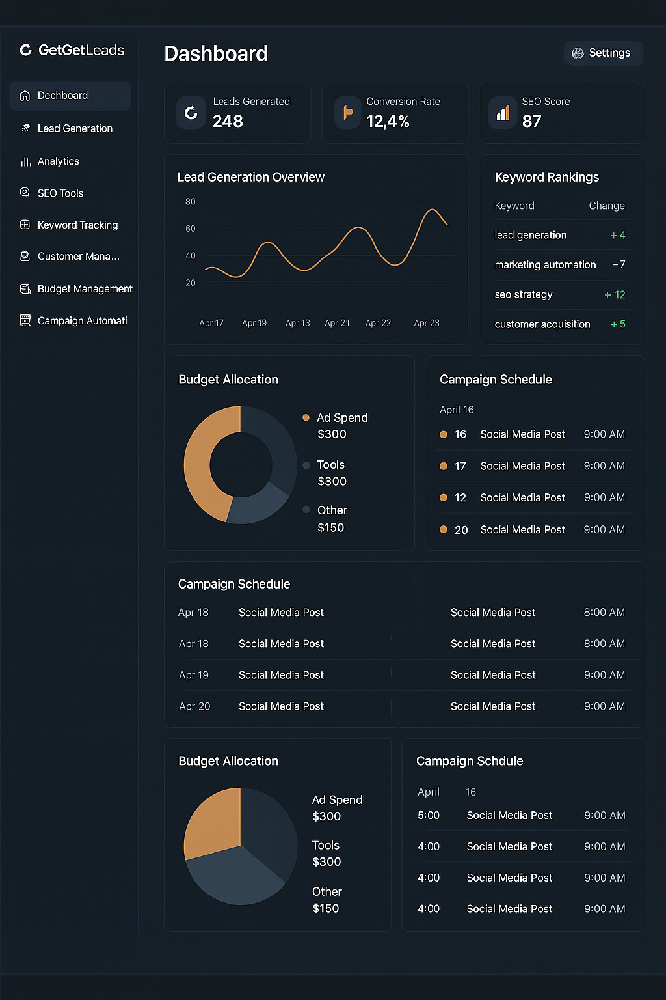

<h1 align="center">👋 Hello, I'm Santhosh Guntupalli</h1>
<h3 align="center">Experienced Data Engineer | Cloud & Machine Learning Enthusiast</h3>

  

---

## 🔍 About Me

-  Data Engineer with strong interests in **Cloud Engineering**, **Data Science**  and **Artificial Intelligence**

---

## 🧠 Technical Proficiency

### 👨‍💻 Programming Languages & Frameworks
Python, Java, JavaScript, C, C#, C++, Scala, R, Shell Scripting, Golang

### ☁️ Cloud Technologies
AWS, GCP, Azure, Snowflake, Oracle, Docker, Kubernetes

### 🏗️ Big Data & Data Engineering
Spark, Kafka, Hadoop, Hive, Airflow, HBase, Nifi, Teradata, Redshift, MapReduce, Flume, Flink, Informatica, Talend, AWS Glue, S3, Databricks, ADF, Synapse, Trifacta, JSON, Avro, Parquet, ORC, XML, Protobuf, PostgreSQL, MongoDB, BigQuery, Elasticsearch, ELK Stack, HDFS

### 🤖 Machine Learning 
TensorFlow, PyTorch, scikit-learn, PySpark, NLTK, LLMs

### ⚙️ DevOps & Tools
Jenkins, GitHub, Git, JIRA, Confluence, REST APIs, Tableau, Power BI, Prometheus, Splunk, PowerShell, Linux, Bash, Pub/Sub, Jupyter Notebooks, PyCharm

---

## 🌐 Portfolio & Visualizations

- 📝 <a href="https://guntupalli09.github.io/Santhosh_Guntupalli.github.io/">
- 📊 <a href="https://public.tableau.com/app/profile/santhosh.guntupalli/vizzes">
- 📫 <a href="mailto:santhosh.guntupalli09@gmail.com">

---

## 🤝 Connect With Me

---

## 🚀 Featured Projects

### 1. 👥 GhostWriter Teams

<table>
<tr>
<td width="60%">
An AI-powered creative marketing workspace driven by LangChain and local LLMs.  
Features five specialized AI agents simulating a real team for creative collaboration.

**Agents:**
- 🎨 Zara: Creative strategist  
- ✍️ Max: Content writer  
- 📊 Mira: Research analyst  
- 🔍 Eva: Critique expert  
- 🛡️ Leo: Brand guardian  
</td>
<td>

</td>
</tr>
</table>

---

### 2. 🚀 GetGetLeads – AI Digital Marketing Agent

<table>
<tr>
<td width="60%">
A marketing assistant for lead generation, campaign automation, and analytics — all in one platform.

**Features:**
- 🧲 AI-Powered Lead Generation  
- 📈 Campaign Performance Dashboards  
- 🔍 SEO Tools with Smart Insights  
- 🏷️ Keyword Position Tracking  
- 💬 Lead CRM  
- 💸 Budget Management  
- 📅 Multi-Channel Automation
-  Social Media Automation
</td>
<td>

</td>
</tr>
</table>

---

### 3. ✈️ GetGetPlaces – AI Travel Agent

<table>
<tr>
<td width="60%">
An intelligent travel planner using natural language, live weather data, and ML recommendations.

**Key Features:**
- 🗣️ Natural Language-Based Planning  
- 🌤️ Real-Time Weather Integration  
- 📍 Smart Routing & Time Calculation  
- 🧠 AI Itinerary Generator  
- 📈 Price Prediction (ARIMA)  
- 🎯 Personalized Recommendations  
- 🗃️ PostgreSQL Database Integration  
</td>
<td>

</td>
</tr>
</table>

---

### 4. 🎬 [Movie Recommendation Engine](https://mrs-sg-bfc2e6fa78db.herokuapp.com/)

<table>
<tr>
<td width="60%">
A content-based recommender system that suggests films using NLP and TF-IDF techniques.

**Skills & Tools:**  
scikit-learn, TensorFlow, NLTK, Flask, Pandas, Jupyter, Feature Engineering  
</td>
<td>

</td>
</tr>
</table>

---

### 5. 📊 [Data Visualization Projects](https://public.tableau.com/app/profile/santhosh.guntupalli/vizzes)

A portfolio of Tableau dashboards focused on domain knowledge, storytelling, and design.

---

### 6. 📈 [Real-Time Stock Market Analysis](https://github.com/guntupalli09/stock_market-real_time-analysis)

Live stock market insights using streaming data pipelines built on Kafka, AWS EC2, Glue, Athena.

---

### 7. 🐍 Snake Game – Python GUI

<table>
<tr>
<td width="60%">
A Tkinter-based dynamic Snake Game showcasing GUI logic and event handling.  
Demonstrates problem-solving and real-time interactions.
</td>
<td>

</td>
</tr>
</table>

---

### 8. 🏓 Pong Game AI – NEAT Algorithm

<table>
<tr>
<td width="60%">
An autonomous Pong-playing AI built using the NEAT algorithm.  
Evolves neural networks through reinforcement learning to optimize performance.
</td>
<td>

</td>
</tr>
</table>

---

## 📜 Certifications

1. META – Database Structures and Management with MySQL  
2. META – Version Control  
3. META – Advanced MySQL  
4. Prompt Engineering for ChatGPT – Vanderbilt University  
5. IBM – Exploratory Data Analysis for ML  
6. Machine Learning Specialization – University of Washington  

---

## 📊 GitHub Stats

  

